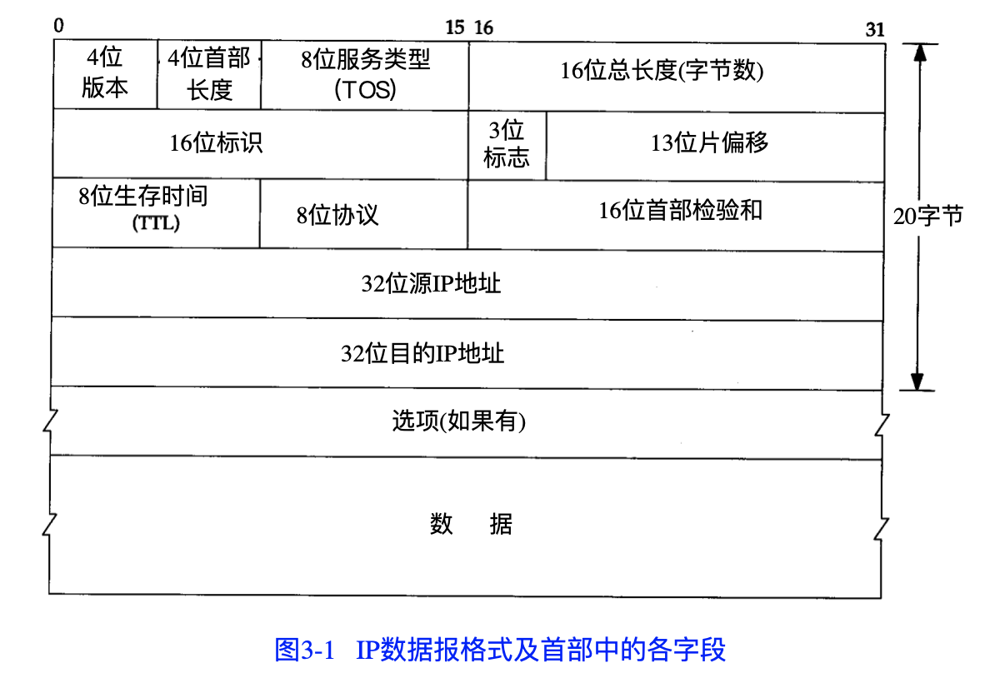

IP模块提供不可靠，无连接的数据报传送服务 

**不可靠：** 不保证数据报能成功送达 

**无连接：** IP模块不维护任何关于后续数据报的状态信息，每个数据报的处理是相互独立的

## IP首部

## IP路由选择 

IP模块可以从本地或者网络接口接收数据报并发送 

其中本地生成的数据报可以来自，TCP, UDP, ICMP 或者IGMP 

当IP模块收到一份数据报时

1. 检查数据报目的地址是否为本机IP地址，或广播地址

    是，转发数据报到首部协议字段指定的模块进行处理
    
    不是，查询内存中路由表进行转发

2. 搜索路由表

    a). 寻找与目的IP地址完全匹配的表项

    b). 寻找与目的网络号匹配的表项 

    c). 寻找默认表项 