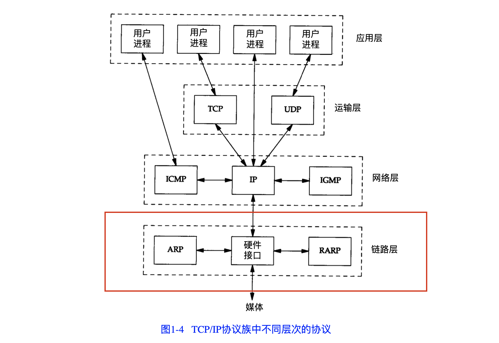

**tcp/ip协议族中，链路层的作用**

1. 为IP模块发送和接收IP数据报 
2. 为ARP模块发送ARP请求和接收ARP应答
3. 为RARP模块发送RARP请求和接收RARP应答

TCP/IP支持多种不同的链路层协议，如：以太网，令牌环网等

## 以太网链路层协议 

## 串形链路层协议 (SLIP, PPP)

SLIP: serial line ip, 串形线路上对IP数据报进行封装的一种形式

PPP: 点对点协议

## MTU 

最大传输单元: 以太网（链路层）对数据帧的长度限制 

路径MTU: 两台通信主机路径中的最小MTU

如果IP数据报的长度大于链路层MTU，那么IP层就需要对数据报进行分片

